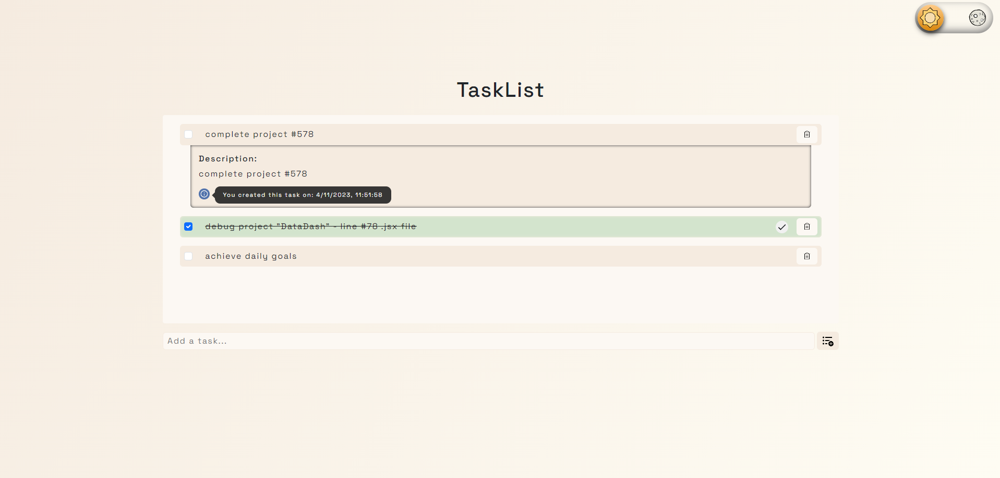
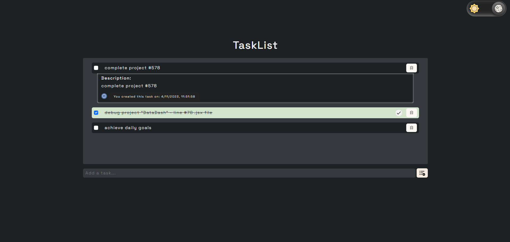

# TaskList App


A simple task list application built with React and Redux. Manage your tasks with ease.

## Demo

Check out the live demo [here](https://yourusername.github.io/tasklist-app).

## Features

- Light and dark theme support 🌞🌙
- Add, remove, and mark tasks as completed ✅
- Task descriptions and creation date 📅
- Responsive design for mobile and desktop 📱💻
- Automatic data persistence with `localStorage` 📁

## Screenshots

|                       Light Theme                        |                       Dark Theme                       |
| :------------------------------------------------------: | :----------------------------------------------------: |
|  |  |

## Getting Started

Follow these steps to run the app on your local machine:

1. Clone the repository:

   ```bash
   git clone https://github.com/yourusername/tasklist-app.git
   ```

2. Install the dependencies:

   ```bash
   cd tasklist-app
   npm install
   ```

3. Start the development server:

   ```bash
   npm start
   ```

4. Open your browser and go to `http://localhost:3000` to use the app

## Usage

1. Add a new task by entering a task description in the input field and clicking the "Add" button.
2. Mark tasks as completed by checking the checkbox.
3. View additional task details by clicking on a task.
4. Remove tasks by clicking the trash can icon.
5. Your tasks are automatically saved in `localStorage`, so they persist even after you close the browser or refresh the page.

## Contributing

Feel free to open an issue or submit a pull request if you'd like to contribute to this project.
We welcome your suggestions and improvements.

## License

This project is licensed under the MIT License.

Enjoy managing your tasks with the TaskList App! 😄
